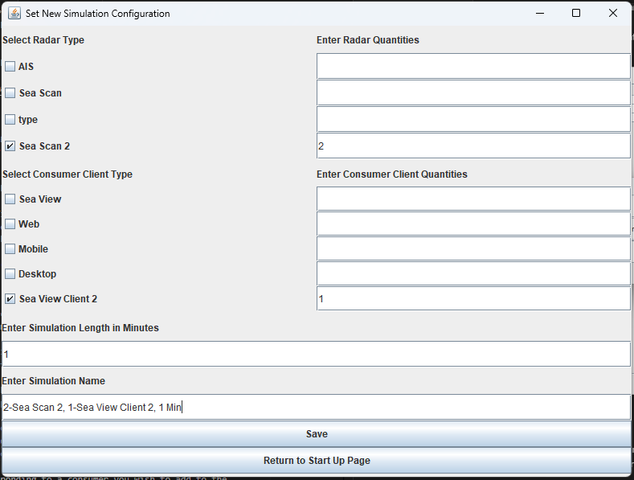

# CS4770-2023

## Table of Contents
1. [Simulation Environment Setup](#simulation-environment-setup)
2. [Running the Simulation](#running-the-simulation)
3. [Report Environment Setup](#report-environment-setup)
4. [Generating the Report](#generating-the-report)
5. [Design Documentation Section](https://github.com/Alireza-rahnama/benchmarking_final_product/tree/GUI_Version2/benchmarking_simulation/docs/documentation)

## Simulation Environment Setup
These instructions explain have been tested in both a Windows and Ubuntu
systems. Instructions should be similar for other operating systems and IDEs.
We will describe how to setup the Eclipse IDE.

### Prerequisites
 * A connection string is required for the producer (Sea Scan) and consumer
   (Sea View) clients.

### Setting up MongoDB Atlas to be used with the application

1. [Sign up for a MongoDB atlas account.](https://www.mongodb.com/cloud/atlas/register)

2. Inside Data Services > Database click Build a Database.

3. Choose the database, Provider, Region and give the cluster a name. (I chose the free M0 environment, Amazon AWS provider, us-east region and named the cluster `SimulationCluster1`)

4. Add a username and password and store them in a secure place and click `Create`. This will be supplied into our simulation application later

5. Under `Where would you like to connect from?` choose the `My Local Environment` option.

6. Next, we must specify which IP addresses can connect to our instance. Our simulation application will connect to a MongoDB instance directly. Therefore, the IP address which we are using to connect to the instance must be added to Atlas before we can run the application. If you wish to allow all address enter `0.0.0.0/0` in the IP Address field and a description such as `Allow all addresses`. Then click `Add Entry`.

7. At the bottom of the page click `Finish and Close`.

8. Click `Go to Databases`.

9. Click `Connect`.

10. Click `Drivers`.

11. Select the `Java` Driver and choose version `4.3 or later`.

12. Scroll down to the `Add your connection string into your application code` section and note the connection string. You will need to replace the `<password>` part of the connection string with the password for the user you created earlier.

13. click `Close`.

The MongoDB Atlas has now been setup with the configuration required for the Simulation Application, and you should have copies of the username, password, and connection string required to connect to the database that will be added to the .env configuration file when setting up the Simulation Application environment.

### Installing the Eclipse IDE
1. Install the [Eclipse IDE for Java Developers][eclipse]. The project uses
Java 17 which will be installed automatically by using the Eclipse Installer
in Eclipse version 4.27.0. Other versions may bundle a different version of
Java so you may need to install JRE/JDK version 17 if using a different
version of Eclipse.

2. Launch Eclipse and choose a folder to store the workspace.

3. Close the welcome page.

4. If you wish to clone the repository from GitHub into the Eclipse IDE
click [here](#cloning-the-repository-from-github-using-the-eclipse-ide).
If you wish to import the project from the local file system click
[here](#importing-the-project-from-a-folder-into-the-eclipse-ide).

### Cloning the repository from GitHub using the Eclipse IDE
1. In the `Package Explorer` select `Import projects...`

5. In the import Dialog select `Git` > `Projects from Git (with smart import)`
then click the `Next >` button.

6. Enter the SSH git URI of the repository. Click `Next >`. If you get an 
error you may need to generate a new SSH key or add an existing one to
your GitHub account (see [the following instructions][github-ssh]).

7. On the next screen we ensure that the `main` branch is selected other
branches may not necessary to track, so you may choose to deselect them. Then
click the `Next >` button again.

8. Ensure that `main` is our initial branch and click `Next >`. Eclipse will 
then begin cloning the repository (this may take some time ~3 minutes).

9. On the next screen we are asked to select which projects we wish to
import into the workspace. Ensure that `Search for nested projects` is
checked and then verify that all listed folders are selected to be imported.

10. Click `Finish`.

The Java Project is contained in the `benchmarking_simulation` folder. It may
take some time for the project to build the first time. Progress of the build is
displayed in the bottom right corner.

Before running the application you must configure the .env file click
[here](#creating-the-env-configuration-file) to jump to that section.

### Importing the project from a folder into the Eclipse IDE
1. In the `Package Explorer` select `Import projects...`.

2. Select `General` > `Projects from Folder or Archive`.

3. Select the `Directory..` button and browser to where the project root folder
(CS4770-2023 if folder is named the same as repository).

4. Ensure that `Search for nested projects` is checked. You only need to check
the `benchmarking_simulation` and the `benchmarking_simulation/.settings`
folder.

5. Click `Finish`.

The Java Project is contained in the `benchmarking_simulation` folder. It may
take some time for the project to build the first time. Progress of the build is
displayed in the bottom right corner.

Before running the application you must configure the .env file click
[here](#creating-the-env-configuration-file) to jump to that section.

### Creating the .env configuration file
The .env file stores the connection string and the
token required to connect to the S6 Node, the file also stores a connection
string, username and password for connecting to the MongoDB instance. MongoDB is used
by the application to store simulation configuration data (for instance number
of radars and radar transmission interval).

1. Create a file named `.env` inside the `benchmarking_simulation` folder.

2. Add the following to `benchmarking_simulation/.env`:

       ACCESS_TOKEN="<access token>"
       SEA_SCAN_TARGET_URI=<sea scan (producer client) connection uri>
       SEA_VIEW_SERVICE_TARGET_URI=<sea scan (consumer client) connection uri>
       DATABASE_CONNECTION_STRING="<MongoDB connection string>"
       DB_USERNAME="<username required to connect to database>"
       DB_PASSWORD="<password required to connect to database>"

## Running the Simulation

### Prerequisites
 * [The project has been imported into the Eclipse IDE](#simulation-environment-setup)
   (steps may be similar for other IDEs).
 * A `.env` file has been created containing the configuration required to
   connect to the S6 Node and a MongoDB instance.
 * The S6 Node and MongoDB instances are running.

### Starting the application
1. Expand `benchmarking_simulation` > `src/main/java` > `com.rutter`.
2. Right-click `StartUpPage.java`, select `Run As` > `1 Java Application`.

### Configuring a radar station
Radar Stations are the producer clients in our simulation they transmit
PngImageMessages to the S6 Node at a configurable frequency. Radar Stations
record details about every message it sends to the S6 Node. Configured Radar
Stations are saved to the configured MongoDB instance.

1. From the start up page click the `Radar Catalog` button.
2. Click `Add New Radar`.
3. Specify the radar name, type and transmission interval. If you wish to
simulate a radar that transmits every 2400 milliseconds enter 2400.
Transmission interval must be specified as a positive number. (Refer to image
below for example of a radar that transmits every 2400 ms).
4. Click `Save Radar`.
5. Repeat from step 2 for each radar you wish to simulate.
6. Click `Back` to return to the start up page.

### Configuring a consumer
Consumer clients receive messages from the S6 Node they record details from 
all messages received from the S6 Node. Consumers are saved to the MongoDB
instance.

1. From the start up page click the `Consumer Catalog` button.
2. Click `Add New Client`.
3. Enter a type for the type field. It can take any String and will be used
in the next step when we define the simulation configuration.
4. Click `Back` to return to the start up page.

### Configuring a simulation
A Simulation Configuration specifies which radars and how many are associated
with a simulation, which consumers and the quantity of consumers are
associated with a simulations, as well as the length of a Simulation
Configuration. A saved Simulation Configuration must be chosen when running
the simulation. Simulation Configurations are saved in MongoDB.

1. From the start up page click the `Configure Simulation` button.
2. Select the check box corresponding to a radar you wish to add to the
simulation configuration
3. Enter the quantity of the selected radar you wish to add. This will create
copies of the same Radar Station. In this way we can create many Radar Stations
of the same interval without needing to define a new Radar Station each time.
5. Repeat from step 2 for each Radar Station we wish to add.
6. Select the check box corresponding to a consumer you wish to add to the
simulation configuration.
7. Enter the quantity of consumer clients you wish to add of the same type.
8. Repeat from step 6 for each consumer you wish to add.
9. Enter the length in time you wish to run the simulation as a number in
minutes.
10. Give the Simulation Configuration a name.
11. Click `Save`.
12. Click `Return to Start Up Page`.

### Running a simulation configuration
Before you begin any simulation be advised that you check the
`benchmarking_simulation` folder for both a `producerRecords.csv` and
`consumerRecords.csv` file and make a copy of them if you wish to keep them.
These contain the transcript of each simulation. They will be overwritten if
you do not move them somewhere else.

1. From the start up page click the `New Simulation` button.
2. Select the Simulation Configuration you wish to run.
3. Click `Run Simulation`.
4. Once the simulation has finished it stores a `producerRecords.csv` file and a
`consumerRecords.csv` file in the benchmarking_simulation folder. These files
contain a transcript of all messages sent (`producerRecords.csv`) and all
messages received (`consumerRecords.csv`) during a simulation. **You must
move these files to a new location to prevent them from being overwritten
the next time you run the simulation.**

The simulation is running while the Run button remains pressed.
The simulation is finished when both the Run button is no longer pressed and
the console says that all radars have stopped and all clients have stopped.
As represented in the below screenshot.

## Report Environment Setup

This section will explain how to setup the report environment in Visual
Studio Code it is written in a Jupyter Notebook and uses the Pandas data
analysis tool.

### Prerequisites
 * An installation of Visual Studio Code.
 * Python 3.10 or higher.

### Steps
1. Open the `CS4770-2023/report_generator` folder inside Visual Studio Code and
trust the folder so we can run the Jupyter Notebook in a future step.

2.  Open `report_generator.ipynb` this contains the notebook that generates the
report.

3. Click `Select Kernel` in the top-right kernel and 
`Install suggested extensions Python + Jupyter`

4. Visual Studio Code prompts to install the `ipykernel and pip package` press
`Install`.

5. The project requires the use of the `pandas` package. Pandas can be installed
from the PyPI repository via pip using the command `pip install pandas`.

6. Finally, we need to install `jinja2` which can be done by running the
command `pip install jinja2`.

## Generating the Report

### Prerequisites
 * A simulation has already run and you have copies of both the producer
   record and consumer record CSV files.
 * [Setup the report environment.](#report-environment-setup)

### Dependencies
 * Python 3
 * Jupyter
 * Pandas

### Steps to generate the report
1. Open `report_generator/report_generator.ipynb` inside Visual Studio Code.

2. In the second block of code we see something that looks like this

       # reading the csv files
       consumer_record = pd.read_csv('../benchmarking_simulation consumerRecords.csv', names=consumer_column_names, header=None)
       producer_record = pd.read_csv('../benchmarking_simulation/producerRecords.csv', names=producer_column_names, header=None)

3. Replace `../benchmarking_simulation/consumerRecords.csv` and 
`../benchmarking_simulation/producerRecords.csv` with the new file paths to the
consumer and producer records respectively. **It is recommended that you move
these records to a different location otherwise, if you
wish to run the simulation again these records will be deleted and replaced
with new ones and the previous records will be lost.**

4. Click `Run All`.

The notebook will generate a report from the CSV files provided that will appear
similar to the image below:

We can see the unique IDs of each radar, the number of messages sent by each
radar and the number of messages received by each consumer.

Below that we see the "Record of all messages" where messages that were both
sent by a producer and received by all consumers are displayed in white and
messages that were sent but not received by all consumers a displayed in red.

[eclipse]: https://www.eclipse.org/downloads/packages/installer "Download Eclipse IDE installer"
[github-ssh]: https://docs.github.com/en/authentication/connecting-to-github-with-ssh/adding-a-new-ssh-key-to-your-github-account "Adding a new SSH key to GitHub"
